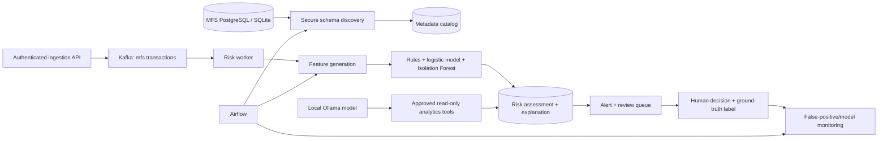

# Data Sentinel AI

**Secure MFS Transaction Intelligence & Risk Platform**

Data Sentinel AI ingests tenant-scoped Mobile Financial Services transactions, streams them through Kafka, runs an explainable hybrid rules + machine-learning risk engine, opens high-risk alerts for human review, and tracks model and pipeline outcomes. The original Vendor Portal remains the licensing/control plane; the Customer Portal is now the MFS operations plane.

## Architecture at a glance



The system preserves Ed25519 licensing, role-based access, tenant isolation, customer-scoped credentials, CSRF protection, and audit logging. MFS data never enters the Vendor Portal.

## Quick start

Prerequisites: Docker Desktop/Compose and at least 8 GB free memory (more if Ollama is enabled).

```bash
cp .env.example .env
cp vendor_portal/.env.example vendor_portal/.env
cp customer_portal/.env.example customer_portal/.env
python -c "from cryptography.fernet import Fernet; print(Fernet.generate_key().decode())"
# Fill every blank secret in the root .env with independently generated values.
# Paste the Fernet value into DATA_SOURCE_ENCRYPTION_KEY.

docker compose run --rm airflow-init
docker compose up --build -d --scale customer-web=2 --scale risk-worker=3
# Optional local Qwen model (downloads the model once):
docker compose --profile llm up -d ollama ollama-init
```

Open:

- MFS Customer Portal: <http://localhost:8000/mfs/>
- Measured Business KPIs: <http://localhost:8000/mfs/business-kpis/>
- Vendor Portal: <http://localhost:8001/>
- Airflow: <http://localhost:8080/> (`admin` / the configured `AIRFLOW_ADMIN_PASSWORD`)

Create a plan and customer in the Vendor Portal as before. The provisioned customer owner becomes an MFS `ORG_ADMIN`. Then train and load the synthetic demo:

```bash
docker compose exec customer-web python manage.py train_risk_model --organization 1
docker compose exec customer-web python manage.py seed_mfs_demo --organization 1 --count 250
docker compose exec customer-web python manage.py create_mfs_api_key --organization 1 --name demo-ingestion
```

For the real Kafka end-to-end demonstration (the risk worker must be running):

```bash
docker compose exec customer-web python manage.py demo_mfs_flow \
  --organization 1 --reviewer 1 --source 1 --decision REJECT
```

The optional source is created from **Data → Connect database** with host `mfs-source-db`, port `5432`, database `mfs_source`, user `mfs_reader`, the configured `MFS_SOURCE_PASSWORD`, and SSL disabled for this local-only network.

## Documentation

- [Architecture and data model](docs/architecture.md)
- [APIs and Kafka event contracts](docs/api-and-events.md)
- [Operations, Airflow, ML, and demo runbook](docs/operations.md)
- [Business KPI definitions and evidence](docs/business-kpis.md)
- [Scalability design and load-test runbook](docs/scalability.md)
- [Security and privacy controls](docs/security.md)
- [Implementation status and roadmap](docs/implementation-status.md)
- [Vendor Portal guide](vendor_portal/README.md)
- [Customer Portal legacy/account guide](customer_portal/README.md)

## Verification

```bash
cd vendor_portal && env/bin/python manage.py test
cd ../customer_portal && env/bin/python manage.py test
cd .. && DATA_SOURCE_ENCRYPTION_KEY='<valid Fernet key>' docker compose config -q
```

Current automated baseline: **30 Vendor Portal tests + 63 Customer/MFS tests**. The MFS tests cover tenant isolation, API-key hashing, ingestion idempotency, Kafka publication boundaries and compatible delivery settings, real model training/metrics, explainable scoring, schema discovery/versioning, PII detection, encrypted connector secrets, measured business KPI calculation, and rejection of unsafe LLM tool selection.
